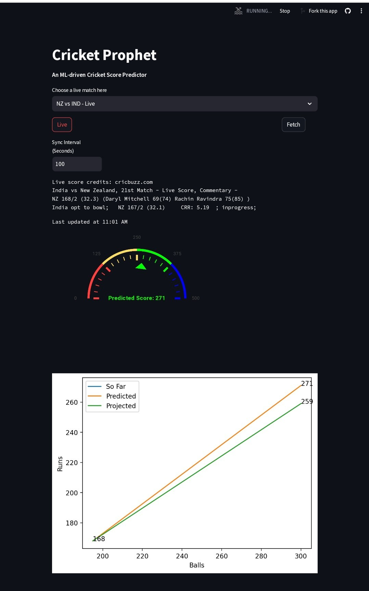
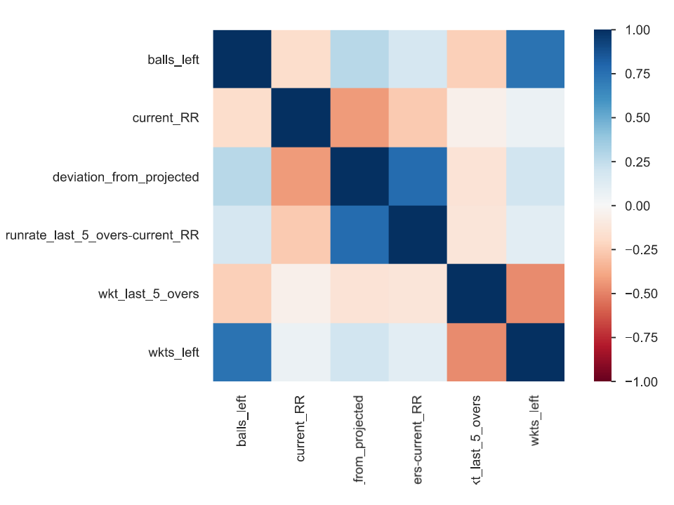
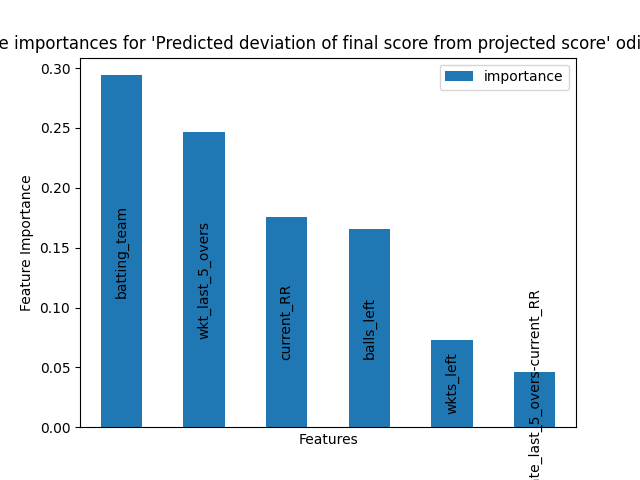
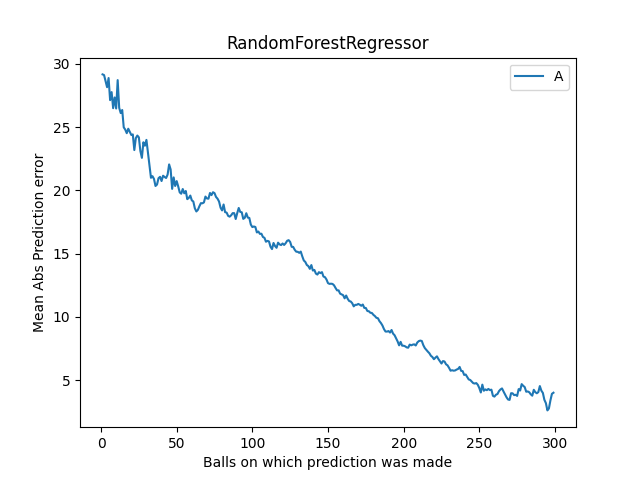
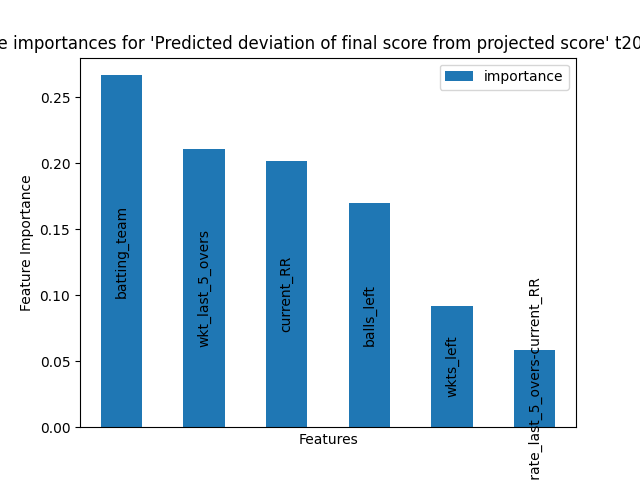
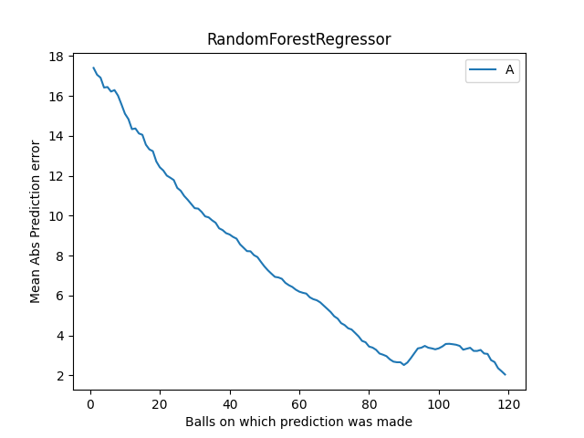

# Cricket-Prophet is an AI-Ml based cricket score prediction app.

The app is online at https://cricket-prophet.streamlit.app/

It takes account of batting team, current run, fall of wkts and gives a realistic prediction of the final score using a #randomforest. Scores are fetched from #cricbuzz site in realtime. It is a better prediction than the projected score as it doesn't only rely on current run rate, but also balls left, wkts left and batting team.

## 

# ODI

# T20

