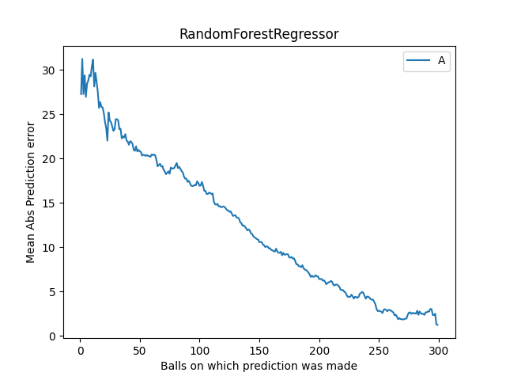
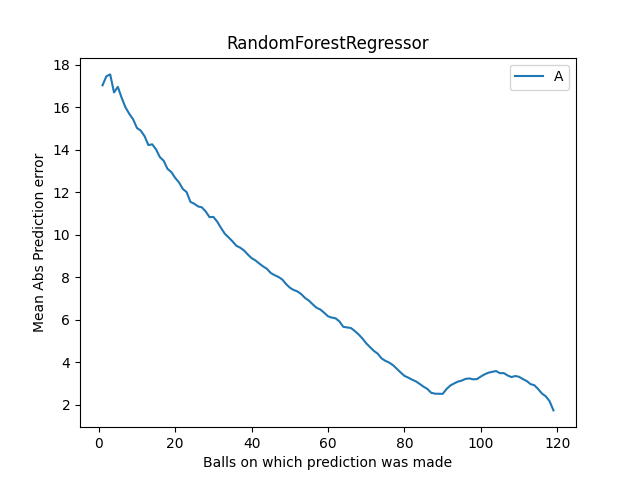

# Cricket-Prophet: AI-Powered Cricket Score Prediction

**Predict cricket scores with accuracy beyond traditional encounter-based or runrate-based predictions!**

## Key Features

- **Live score scraping:** Stays up-to-date with real-time match data.
- **Intelligent prediction:** Leverages a Random Forest model for comprehensive analysis.
- **Factors beyond run rate:** Considers wickets left, last 5 overs, and more for precise predictions.
- **Comprehensive metrics:** Track MSE scores of 11.68 for T20 and 20.44 for ODI formats.

## Get Started

- **Explore the app:** https://cricket-prophet.streamlit.app/

## How It Works

1. **Live score scraping:** Fetches live match data from CricBuzz.
2. **Feature engineering:** Extracts relevant features from the match data and tried to predict deviation of score from projected score
3. **Model prediction:** Applies a pre-trained Random Forest model to predict the final score.
4. **Visualization:** Displays predictions and insights clearly.

## Performance Insights

### Why is it better than runrate based projected score?

Refer to the below table, think of variance as MSE of projected score

| Format | Measuring after n balls played | Variance (Train) | Variance (Test) | Model MSE (Train) | Model MSE (Test) |
| ------ | ------------------------------ | ---------------- | --------------- | ----------------- | ---------------- |
| T20    | 30                             | 498.41           | 514.90          | 9.02              | 9.26             |
| T20    | 60                             | 218.03           | 234.74          | 5.73              | 5.89             |
| T20    | 90                             | 80.19            | 82.53           | 3.82              | 3.79             |
| ODI    | 120                            | 745.17           | 702.39          | 13.28             | 13.97            |
| ODI    | 180                            | 360.02           | 358.21          | 9.12              | 9.83             |
| ODI    | 240                            | 134.28           | 125.87          | 4.33              | 5..06            |

**ODI Format**

- Correlation matrix:

- Feature importance:

- Evaluation:

**T20 Format**

- Correlation matrix:

- Feature importance:

- Evaluation:

